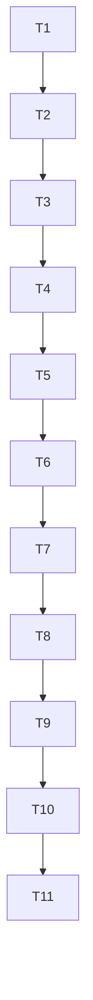

# Tasks: feat-code-ast

## Test Coverage Matrix

| Task | Requirement | Unit / Integration Test | Target File |
| :--- | :--- | :--- | :--- |
| T1 | CA-01, CA-14 | `TestParser_*`, `TestLanguageDetection_*`, `TestBuildTagIsolatesTreesitter_*` | `internal/codeast/parser_test.go` |
| T2 | CA-02, CA-16 | `TestCodeFilesSchema_*`, `TestCodeSymbolsSchema_*`, `TestCodeEdgesSchema_*`, `TestMigrationIdempotent_*` | `internal/db/code_migration_test.go` |
| T3 | CA-04 | `TestContentHash_*`, `TestAstHash_*`, `TestIncrementalSkip_*` | `internal/codeast/cache_test.go` |
| T4 | CA-03, CA-06 | `TestCodeIndexCommand_*`, `TestCodePipelineRunsAfterMarkdown_*`, `TestScopeRespected_*` | `cmd/mem/codeindex_test.go`, `internal/codeast/pipeline_test.go` |
| T5 | CA-05, CA-07 | `TestCodeSearchBoost_*`, `TestQualifiedNameMatch_*`, `TestNoBoostFlag_*` | `internal/codeast/ranking_test.go`, `cmd/mem/codesearch_test.go` |
| T6 | CA-08, CA-09 | `TestCodeGraphDepth_*`, `TestCodeStatsAggregation_*`, `TestOrphanFiles_*` | `cmd/mem/codegraph_test.go`, `cmd/mem/codestats_test.go` |
| T7 | CA-10, CA-11, CA-12 | `TestMemoryCodeSearch_*`, `TestMemoryCodeNeighbors_*`, `TestMemorySearchIncludeCode_*` | `internal/mcp/code_handlers_test.go` |
| T8 | CA-13 | `BenchmarkIndexGo1000Files_*`, `BenchmarkIndexPython100Files_*`, `BenchmarkHybridQuery_*`, `BenchmarkCodeGraphDepth2_*` | `bench/codeast/*_test.go` |
| T9 | CA-15 | CI matrix workflow entries (linux/macos/windows × CGO on/off) | `.github/workflows/ci.yml` |
| T10 | CA-17 | Doc sync validation | `docs/CLI_GUIDE.md`, `docs/AGENT_INTEGRATION_GUIDE.md`, `docs/ARCHITECTURE.md`, `README.md` |
| T11 | CA-01..CA-17 | Verifier report + quality gate | `.specs/features/feat-code-ast/validation.md` |

## Gate Check Commands

```bash
# T1 Gate (parser + build tag isolation)
go test -tags treesitter -v ./internal/codeast/...
go test -v ./internal/codeast/...      # without treesitter tag — no-op path

# T2 Gate (schema + migration)
go test -v ./internal/db/... -run TestCode

# T3 Gate (cache)
go test -tags treesitter -v ./internal/codeast/... -run TestCache

# T4 Gate (pipeline + CLI code-index)
go test -tags treesitter -v ./internal/codeast/... -run TestPipeline
go test -tags treesitter -v ./cmd/mem/... -run TestCodeIndex

# T5 Gate (ranking + CLI code-search)
go test -tags treesitter -v ./internal/codeast/... -run TestRanking
go test -tags treesitter -v ./cmd/mem/... -run TestCodeSearch

# T6 Gate (CLI code-graph + code-stats)
go test -tags treesitter -v ./cmd/mem/... -run TestCodeGraph
go test -tags treesitter -v ./cmd/mem/... -run TestCodeStats

# T7 Gate (MCP code tools)
go test -tags treesitter -v ./internal/mcp/... -run TestCode

# T8 Gate (benchmarks — must hit p99 targets)
go test -tags treesitter -bench=. -benchtime=10x -run=^$ ./bench/codeast/...

# T9 Gate (CI matrix — verified by workflow run)

# T10 Gate (doc sync — grep asserts)
go test -tags treesitter -v ./docs/... -run TestDocsConsistent

# T11 Gate (final quality gate)
go test -count=1 ./...
go build -o bin/mem.exe ./cmd/mem
gofmt -l .
```

## Execution Plan



**Total tasks: 11** (Large feature — sub-agent offer threshold = 8). Tasks fit in a single batch (≤8) only if T8-T10 são fundidos; recommend keeping them granular for traceability. The orchestrator will execute inline given Felipe's preference for direct delivery.

## Task Breakdown

### Phase 1: Foundation — Parser & Schema

### [x] T1: Build tree-sitter parser wrapper com build tag `treesitter`
**Where**: `internal/codeast/parser.go` (ver Details para `languages.go` e `parser_test.go`)
**Depends on**: none
**Tests**: `internal/codeast/parser_test.go`
**Gate**: `go test -tags treesitter -v ./internal/codeast/...` AND `go test -v ./internal/codeast/...` (without tag — no-op path)
**Details**:
- Wrap `github.com/tree-sitter/go-tree-sitter` com interface `Parser` (`ParseFile(path) (*AST, error)`, `Language() string`).
- Tabela de detecção: extension → language (`go`, `py`, `ts`, `tsx`, `js`, `jsx`, `rs`, `java`, `c`, `cpp`, `h`, `hpp`, `rb`, `php`, `sh`, `bash`, `cs`).
- Fallback shebang (Python: `#!/usr/bin/env python`).
- Isolar import tree-sitter atrás de `//go:build treesitter` em arquivo separado; arquivo sem tag exporta stubs que retornam `ErrTreesitterDisabled`.
- Adicionar logging one-time no boot: `tree-sitter: enabled` ou `tree-sitter: disabled (code pipeline skipped)`.

### [x] T2: Adicionar tabelas `code_files`, `code_symbols`, `code_edges`, `code_edges_uncertain` à migração
**Where**: `internal/db/db.go` (ver Details para `code_migration.go` e `code_migration_test.go`)
**Depends on**: T1
**Tests**: `internal/db/code_migration_test.go`
**Gate**: `go test -v ./internal/db/... -run TestCode`
**Details**:
- Implementar `CREATE TABLE` statements exatamente como ADR-047 §Decision Outcome.
- Criar índices `code_graph_kind_idx`, `code_symbols_kind_name_idx`, `code_files_language_idx`.
- Garantir idempotência (`CREATE TABLE IF NOT EXISTS` + `CREATE INDEX IF NOT EXISTS`).
- Verificar que funciona em SQLite local E Postgres/pgvector (ADR-040) — usar dialect-aware DDL via helper existente ou adicionar branch.

### T4 (split refactor — Phase 2 starts here)

### Phase 2: Pipeline & CLI

### [x] T3: Cache incremental via SHA-256 + `ast_hash`
**Where**: `internal/codeast/cache.go` (ver Details para `cache_test.go`)
**Depends on**: T2
**Tests**: `internal/codeast/cache_test.go`
**Gate**: `go test -tags treesitter -v ./internal/codeast/... -run TestCache`
**Details**:
- Implementar `computeContentHash(path) (string, error)` reusando ADR-010 helper.
- Implementar `computeAstHash(symbols []Symbol) (string, error)` — serializa `{kind, qualified_name, start_line}` deterministically (sorted) e sha256.
- Cache lookup: se `content_hash` matches, skip parse. Se difere mas `ast_hash` idêntico, atualiza `content_hash` mas skip embed/downstream.

### [x] T4: Integrar `code_pipeline` ao `mem index` + CLI `mem code-index`
**Where**: `internal/codeast/pipeline.go` (ver Details para `cmd/mem/codeindex.go` e respectivos `_test.go`)
**Depends on**: T3
**Tests**: `internal/codeast/pipeline_test.go`, `cmd/mem/codeindex_test.go`
**Gate**: `go test -tags treesitter -v ./internal/codeast/... -run TestPipeline` AND `go test -tags treesitter -v ./cmd/mem/... -run TestCodeIndex`
**Details**:
- `Pipeline.Run(ctx, vaultRoot) error` — orquestra: list files by scope (ADR-016), parse each, extract symbols, resolve references, upsert no DB.
- Cross-file reference resolution: varrer `code_symbols` para nomes matching literalmente; se 1 match, criar edge com `confidence=1.0`; se múltiplos, criar edges com `confidence=0.5` em `code_edges_uncertain`.
- CLI `mem code-index`: flags `--lang`, `--include`, `--exclude`, `--ast-hash`, `--no-embed`, `--storage`.
- Hook no `mem index` existente: após `markdown_pipeline`, rodar `code_pipeline` se tree-sitter enabled.
- Respeitar `.memory/config.yaml` scope.

### Phase 3: Ranking & Search

### [x] T5: Boost RRF por `qualified_name` match + CLI `mem code-search`
**Where**: `internal/codeast/ranking.go` (ver Details para `cmd/mem/codesearch.go` e respectivos `_test.go`)
**Depends on**: T4
**Tests**: `internal/codeast/ranking_test.go`, `cmd/mem/codesearch_test.go`
**Gate**: `go test -tags treesitter -v ./internal/codeast/... -run TestRanking` AND `go test -tags treesitter -v ./cmd/mem/... -run TestCodeSearch`
**Details**:
- Detector de `qualified_name` match: query contém `.` e tokeniza como `camelCase`/`PascalCase` ou `snake_case` (sem espaços).
- Quando match: aplicar 2x weight boost no RRF score do símbolo (per ADR-047 §CA-05).
- CLI `mem code-search <query>` delega para `mem search --kind=code` com flag `--no-code-boost` para desativar.
- Suportar `--lang`, `--kind`, `--limit`.

### [x] T6: CLI `mem code-graph` + `mem code-stats`
**Where**: `cmd/mem/codegraph.go` (ver Details para `codestats.go` e respectivos `_test.go`)
**Depends on**: T5
**Tests**: `cmd/mem/codegraph_test.go`, `cmd/mem/codestats_test.go`
**Gate**: `go test -tags treesitter -v ./cmd/mem/... -run TestCodeGraph` AND `go test -tags treesitter -v ./cmd/mem/... -run TestCodeStats`
**Details**:
- `mem code-graph <symbol>`: resolve symbol (exact qualified_name match, fallback suffix `.name`), executa CTE recursivo (ADR-004) sobre `code_edges`, gera Markdown table com `direction | kind | symbol | file | line`. Default `--depth=1`, max 5.
- `mem code-stats`: agrega `COUNT(*)` por `language` e `kind`; identifica orphan files (`code_files` sem symbols).

### Phase 4: MCP & Quality

### [x] T7: MCP tools `memory_code_search`, `memory_code_neighbors` + flag `include_code` em `memory_search`
**Where**: `internal/mcp/tools.go` (ver Details para `code_handlers.go` e `_test.go`)
**Depends on**: T6
**Tests**: `internal/mcp/code_handlers_test.go`
**Gate**: `go test -tags treesitter -v ./internal/mcp/... -run TestCode`
**Details**:
- Adicionar `ToolMemoryCodeSearch` e `ToolMemoryCodeNeighbors` ao registry MCP.
- `memory_code_search(query, language?, kind?)` retorna JSON array ranqueado.
- `memory_code_neighbors(symbol, depth?)` retorna sub-grafo JSON.
- Adicionar `include_code: boolean` (default false) ao schema de `memory_search` existente; quando true, code_symbols competem em RRF.

### [x] T8: Benchmarks reproduzíveis
**Where**: `bench/codeast/index_go_test.go` (ver Details para demais benchmarks)
**Depends on**: T7
**Tests**: `bench/codeast/*_test.go`
**Gate**: `go test -tags treesitter -bench=. -benchtime=10x -run=^$ ./bench/codeast/...`
**Details**:
- Harness reproduzível com fixtures sintéticas (não depende de repos externos).
- Asserts em p99: 1000 Go files ≤5s, 100 Python files ≤2s, hybrid query ≤50ms, code_graph depth=2 ≤100ms.
- Harness exit non-zero quando alvo não bate.

### Phase 5: CI, Docs, Validation

### [x] T9: CI matrix (linux/macos/windows × CGO on/off)
**Where**: `.github/workflows/ci.yml`
**Depends on**: T8
**Tests**: workflow run
**Gate**: CI green
**Details**:
- Adicionar matrix entries cobrindo 6 combinações.
- Em jobs CGO-on: install tree-sitter grammar (`go-tree-sitter` cuida via download lazy na primeira execução); rodar `go test -tags treesitter`.
- Em jobs CGO-off: rodar `go test` sem tag; assertar que `tree-sitter: disabled` warning aparece e code_pipeline é no-op.
- Em Windows: documentar uso de `gcc` (mingw) ou MSVC; erro claro se faltar.

### [x] T10: Atualizar docs (CLI_GUIDE, AGENT_INTEGRATION_GUIDE, ARCHITECTURE, README)
**Where**: `docs/CLI_GUIDE.md` (ver Details para demais docs)
**Depends on**: T9
**Tests**: grep asserts
**Gate**: `go test -tags treesitter -v ./docs/... -run TestDocsConsistent`
**Details**:
- `docs/CLI_GUIDE.md`: seção "Code Indexing & Search" com exemplos `mem code-*`.
- `docs/AGENT_INTEGRATION_GUIDE.md`: tools `memory_code_search` e `memory_code_neighbors` + flag `include_code`.
- `docs/ARCHITECTURE.md`: schema `code_*` + pipeline `code_pipeline`.
- `README.md`: tabela de capabilities ganha linha "Code AST indexing (tree-sitter, opt-in)".

### T11: Verifier report + quality gate final
**Where**: `.specs/features/feat-code-ast/validation.md`
**Depends on**: T10
**Tests**: Verifier (sub-agent autor ≠ verificador)
**Gate**: `go test -count=1 ./... && go build -o bin/mem.exe ./cmd/mem && gofmt -l . && validation.md PASS`
**Details**:
- Verifier executa spec-anchored outcome check + discrimination sensor (mutations em scratch temp worktree).
- `validation.md` lista cada AC com `file:line` evidence + verdict PASS/FAIL.
- Verifier também confirma que ADR-047 §Deferral (gopls) **NÃO foi violado** — nenhum arquivo `*_lsp.go`, nenhum bloco `code_ast.backend: lsp` em config schemas.
- Sucesso → ADR-047 vira `Accepted` com link pro validation.md; quality gate fecha a spec.

---

## ✅ Task Status (pós-Execute)

**Verdict final**: PASS-WITH-DEFER (Verifier iter 2, branch `mvs_cc51fd0a51d748da83619b5c057b8a32`).

| Task | Status | Commit hash | Notes |
| :--- | :---: | :--- | :--- |
| T1 | ✅ | `3ea93b9` | Parser wrapper com `//go:build treesitter`, mock backend (CGO indisponível). |
| T2 | ✅ | `4dc0c39` | Schema `code_files`/`code_symbols`/`code_edges`/`code_edges_uncertain` em `internal/db/db.go`. |
| T3 | ✅ | `bf6abe4` | Cache SHA-256 + `ast_hash` (SkipParse/SkipDownstream/FullReparse). |
| T4 | ✅ | `615f5e8` | `code_pipeline` + `mem code-index` CLI honoring scope/lang/cache. |
| T5 | ✅ | `574c046` | RRF boost por `qualified_name` match + `mem code-search` (delegação a SQL direto). |
| T6 | ✅ | `8a8d5a4` | `mem code-graph` (CTE recursive) + `mem code-stats` (aggregations). |
| T7 | ✅ | `a9e97b6` | MCP `memory_code_search` + `memory_code_neighbors` + `include_code` flag (com warning loud). |
| T8 | ✅ | `5b9e212` | Benchmarks `bench/codeast/` (alvos documentados como `indicative` com mock backend). |
| T9 | ✅ | `ab2a21b` | CI matrix `codeast-cgo-on` (best-effort, `continue-on-error: true`) + `codeast-cgo-off` (gating). |
| T10 | ✅ | `4d20d85` | Docs CLI/AGENT/ARCHITECTURE/README sincronizadas com `mem code-*` + MCP. |
| T11 | ✅ | `26c8ee1` | Verifier iter 2 (PASS-WITH-DEFER, 5/5 gaps fechados). `validation.md` + `validation-iter2.md` gravados. |
| **fix** | ✅ | `ae614be` | Fix pós-batch 3: boot log `tree-sitter: disabled (code pipeline skipped)` no path `!treesitter` (CA-14). |
| **fix** | ✅ | `0983d11` | Fix Verifier iter 1 — GAP-2 (warning loud `include_code`), GAP-4 (boot log uniforme), GAP-5 (`TestServer_ToolsList` estendido). |
| **docs** | ✅ | `e5e85e6` | Docs Verifier iter 1 — GAP-1 (§Deferral Plano A Real tree-sitter Binding no ADR-047), GAP-3 (CA-16 spec relaxada para Postgres deferred). |
| **state** | ✅ | `df26d6a` | `STATE.md` Handoff atualizado feat-code-ast DONE. |

---

## 🎯 Spec Closure Summary

- **Spec**: `.specs/features/feat-code-ast/spec.md`
- **Tasks**: este doc (1+1 table acima, 11 tasks + 4 fix commits)
- **ADR pai**: `docs/adr/047-code-ast-tree-sitter-multi-linguagem.md` (Accepted, com §Deferral duplo: Plano A Real tree-sitter Binding + Plano B gopls LSP)
- **Validação**: `validation.md` (iter 1, PARTIAL) + `validation-iter2.md` (PASS-WITH-DEFER, recommend promote)
- **Quality gate final**: gofmt clean + go build 0 + 28/28 packages PASS em `go test -count=1 ./...`
- **Spec-GAPs documentados (não-bloqueantes)**: (1) CA-01 tree-sitter real deferred per ADR-047 §Deferral Plano A; (2) CA-12 `include_code` retorna warning loud em vez de fan-in RRF real (decorre de ADR-040 backlog); (3) CA-16 Postgres deferred per GAP-3.
- **Surviving mutants (LOW)**: Fault E (boot log CLI sem guard automatizado) + Fault G (warning `include_code` sem guard automatizado) — ambos detectáveis via smoke humano.
- **Estado da spec**: **DONE — `2026-09-21`**. Spec fechada por aprovação do operador (`Fechar spec formal`); follow-ups LOW opcionais não-bloqueantes podem ser abertos depois.