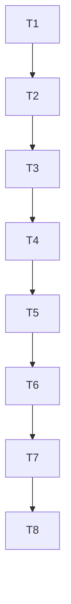

# Tasks: feat-viewer-electron (Phase 1 — MVP)

## Test Coverage Matrix

| Task | Requirement | Unit / Integration Test | Target File |
| :--- | :--- | :--- | :--- |
| T1 | VE-01 | `TestMonorepoScaffold_*` | `electron/`, `viewer/`, `package.json` |
| T2 | VE-02 | `TestElectronMain_*`, `TestPreloadContextBridge_*` | `electron/main.test.ts`, `electron/preload.test.ts` |
| T3 | VE-03, VE-04 | `TestShadcnComponents_*`, `TestTailwindBundled_*` | `viewer/src/components/ui/*.test.tsx` |
| T4 | VE-07 | `TestCSPMetaTag_*` | `viewer/index.html` assertion |
| T5 | VE-05 | `TestAppLayout_*` | `viewer/src/App.test.tsx` |
| T6 | VE-06 | `TestGraphViewFetchesDataCentral_*`, `TestGraphViewRendersCytoscape_*` | `viewer/src/views/GraphView.test.tsx` |
| T7 | VE-08, VE-09, VE-11 | `TestTypeScriptStrict_*`, `TestNpmScriptsExist_*` | `viewer/tsconfig.json`, `electron/tsconfig.json`, `package.json` |
| T8 | VE-10, VE-12, VE-13 | `TestPlaywrightSmoke_*`, `TestDocsUpdated_*` | `scripts/viewer-smoke.test.mjs`, `README.md`, `docs/VIEWER.md` |

## Gate Check Commands

```bash
# T1 Gate (scaffold)
ls electron/ viewer/ package.json 2>&1

# T2 Gate (Electron main + preload)
npm install && npm run typecheck

# T3 Gate (shadcn + Tailwind)
npm run build  # ve tailwind compile + bundle

# T4 Gate (CSP)
grep -c "Content-Security-Policy" viewer/index.html

# T5 Gate (App)
npm run dev   # Electron abre; tab Graf renderiza
# screenshot via Playwright: scripts/viewer-smoke.test.mjs

# T6 Gate (GraphView)
# T5 + grep 'cytoscape' viewer/src/views/GraphView.tsx

# T7 Gate (TS strict + npm scripts)
npm run typecheck  # exit 0
grep -E '"(dev|build|typecheck|lint|smoke)"' package.json

# T8 Gate (Playwright + docs)
node scripts/viewer-smoke.test.mjs  # exit 0 + screenshot
grep -c "Viewer Desktop (Electron" README.md
```

## Execution Plan



**Total tasks: 8.** Above 8-task threshold → offer-then-confirm sub-agents (already accepted in this session). 2 batches:

- **Batch 1**: T1 + T2 + T3 + T4 (scaffold + Electron + shadcn + Tailwind + CSP) — 4 tasks
- **Batch 2**: T5 + T6 + T7 + T8 (App + GraphView + TS strict + Playwright + docs) — 4 tasks

Each batch ≤4 tasks, dense enough for one worker each.

## Task Breakdown

### T1: Scaffold monorepo (electron/, viewer/, package.json root)
**Where**: workspace root + `electron/` + `viewer/`
**Depends on**: none
**Tests**: TestMonorepoScaffold_* in scripts/electron-smoke.test.mjs
**Gate**: `ls electron/ viewer/ package.json`
- **Details**:
  - Create `electron/main.ts`, `electron/preload.ts`, `electron/tsconfig.json`, `electron/tsconfig.node.json`
  - Create `viewer/src/main.tsx`, `viewer/src/App.tsx` placeholder
  - Create workspace `package.json` private with deps: `electron@^30`, `vite@^5`, `@vitejs/plugin-react`, `react@^18`, `react-dom`, `typescript@^5`, `tailwindcss`, `postcss`, `autoprefixer`, `cytoscape`, `@types/react`, `@types/cytoscape`, plus `@radix-ui/react-tabs`, `clsx`, `tailwind-merge`, `lucide-react`
  - Scripts: `dev`, `build`, `typecheck`, `lint`, `smoke`

### T2: Electron main + preload com contextBridge
**Where**: `electron/main.ts`, `electron/preload.ts`
**Depends on**: T1
**Tests**: TestElectronMain_* + TestPreloadContextBridge_* in electron/main.test.ts + electron/preload.test.ts
**Gate**: `npm run typecheck` exit 0
- **Details**:
  - `BrowserWindow` with `contextIsolation: true`, `nodeIntegration: false`, `sandbox: true`, `preload: path.join(__dirname, 'preload.js')`
  - In dev: load `http://localhost:5173` (Vite dev server)
  - In prod: load `file://` path to `viewer/dist/index.html`
  - `preload.ts` uses `contextBridge.exposeInMainWorld('memAPI', { platform: process.platform, /* stub methods */ })`
  - Add IPC stubs `loadDataset()`, `runCli()` returning empty promises (Phase 2 will fill)

### T3: shadcn/ui + Tailwind bundled
**Where**: `viewer/src/components/ui/*`, `viewer/src/lib/utils.ts`, `viewer/tailwind.config.ts`, `viewer/postcss.config.js`, `viewer/src/styles/globals.css`
**Depends on**: T2
**Tests**: TestShadcnComponents_* + TestTailwindBundled_* in viewer/src/components/ui/*.test.tsx
**Gate**: `npm run build` shows Tailwind compiled
- **Details**:
  - Run `npx shadcn@latest init` (writes components.json + tailwind preset)
  - Add components: `button`, `card`, `tabs`, `scroll-area`, `tooltip`, `resizable`, `input`, `badge`
  - `tailwind.config.ts` content `./src/**/*.{ts,tsx}`, `darkMode: 'class'`, shadcn preset
  - `globals.css` with shadcn CSS variables (HSL) for dark theme
  - `lib/utils.ts` with `cn()` helper

### T4: CSP strict meta tag (Phase 1 relaxado)
**Where**: `viewer/index.html`
**Depends on**: T3
**Tests**: TestCSPMetaTag_* asserts viewer/index.html
**Gate**: `grep -c "Content-Security-Policy" viewer/index.html` returns ≥1
- **Details**:
  - `<meta http-equiv="Content-Security-Policy" content="default-src 'self'; script-src 'self' 'unsafe-inline'; style-src 'self' 'unsafe-inline'; img-src 'self' data:; connect-src 'self'; font-src 'self'; object-src 'none'; frame-src 'none';">`
  - Add comment `<!-- Phase 2 (ADR-049): remove 'unsafe-inline' for script-src + style-src; use Vite nonce -->`
  - Set `<html lang="pt-BR" class="dark">` for hardcoded dark mode
  - Add `<link rel="stylesheet" href="./src/styles/globals.css">` (or import via main.tsx)

### T5: App layout (Layout + Tabs + placeholders) + i18n setup
**Where**: `viewer/src/App.tsx`, `viewer/src/components/Layout.tsx`, `viewer/src/i18n/index.ts`, `viewer/src/i18n/locales/`
**Depends on**: T4
**Tests**: TestAppLayout_* in viewer/src/App.test.tsx
**Gate**: `npm run dev` opens Electron + tab Graf appears + locale switcher switches pt-BR <-> en
- **Details**:
  - Layout: topbar (logo + theme badge "Dark" via `t('badge.dark')` + locale switcher dropdown) + sidebar (collapsible w/ shadcn `Resizable`) + main area
  - Tabs root with `<TabsList>` containing 3 triggers: "Grafo" (`t('tab.graph')`), "Code" (disabled with tooltip "Phase 2"), "Staleness" (idem)
  - `<TabsContent value="graph">` mounting `<GraphView />`
  - `<TabsContent value="code">` rendering Card com `t('phase2.coming_soon')`
  - `<TabsContent value="staleness">` mesmo padrão
  - **i18next setup**: `viewer/src/i18n/index.ts` with `i18n.init({ resources: { 'pt-BR': { translation: ptBR }, 'en-US': { translation: enUS } }, lng: 'pt-BR', fallbackLng: 'en-US', interpolation: { escapeValue: false } })`. Import side-effect em `viewer/src/main.tsx` antes do `createRoot`.
  - Locale files `viewer/src/i18n/locales/pt-BR.json` e `en-US.json` com chaves: `tab.graph`, `tab.code`, `tab.staleness`, `badge.dark`, `phase2.coming_soon`, `lang.pt-BR`, `lang.en-US`.
  - Locale switcher: shadcn `DropdownMenu` ou `Select`; persiste em `localStorage['mem.locale']`; chama `i18n.changeLanguage()`.
  - Deps adicionadas ao `package.json`: `i18next@^23`, `react-i18next@^15`.

### T6: GraphView com Cytoscape bundled
**Where**: `viewer/src/views/GraphView.tsx`, `viewer/src/lib/cytoscape-init.ts`
**Depends on**: T5
**Tests**: TestGraphViewFetchesDataCentral_* + TestGraphViewRendersCytoscape_* in viewer/src/views/GraphView.test.tsx
**Gate**: Tab Graf renderiza nodes de `data-central.json` via Playwright screenshot
- **Details**:
  - `useEffect(() => fetch('./data-central.json').then(r => r.json()).then(d => setData(d)), [])`
  - Init Cytoscape on mount with container ref; pass `data.nodes`, `data.edges`
  - Style per node `community_color` (CSS shape + label)
  - Tooltip shadcn on tap (`cy.on('tap', 'node', evt => { setSelected(evt.target.id()) })`)
  - Min radius 20, max 80, fit to viewport on layout

### T7: TypeScript strict + npm scripts + build artifacts
**Where**: `viewer/tsconfig.json`, `electron/tsconfig.json`, `package.json`
**Depends on**: T6
**Tests**: TestTypeScriptStrict_* + TestNpmScriptsExist_* via tsc --noEmit
**Gate**: `npm run typecheck` exit 0; `npm run build` produces both `viewer/dist/` and `electron/dist/main.js`
- **Details**:
  - viewer/tsconfig.json: strict, target ES2022, module ESNext, jsx react-jsx, lib DOM/ES2022
  - electron/tsconfig.json: strict, target ES2022, types node, outDir dist
  - Vite config builds viewer/dist/index.html + assets
  - tsc on electron compiles main.ts + preload.ts to dist/
  - Both run in `npm run build`

### T8: Playwright smoke + docs sync
**Where**: `scripts/viewer-smoke.test.mjs`, `README.md`, `docs/VIEWER.md`, `docs/adr/README.md`
**Depends on**: T7
**Tests**: TestPlaywrightSmoke_* in scripts/viewer-smoke.test.mjs + TestDocsUpdated_* via grep asserts
**Gate**: `node scripts/viewer-smoke.test.mjs` exit 0 + screenshot saved
- **Details**:
  - Playwright launches Electron app via `_electron.launch({ args: ['.'] })` (or `electron.launch()` API)
  - Asserts: window visible + page title contains "Grafo de Memória" + tab "Grafo" tab visible + Cytoscape canvas rendered + data-central.json fetched
  - Save `screenshot-qg-phase1.png` for evidence
  - README: add capability row "Viewer Desktop (Electron + React + Vite + shadcn/ui)"
  - `docs/VIEWER.md`: write setup steps (Node 20+, `npm ci`, `npm run dev`, `npm run build`, `npm run typecheck`, `npm run smoke`)
  - `docs/adr/README.md`: mark ADR-037 row as "Superseded by ADR-048" + add ADR-048 row