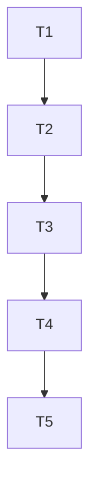

# Tasks: federated-canonical-protocol-and-cross-vault-wikilinks

## Test Coverage Matrix

| Task | Requirement | Unit / Integration Test | Target File |
| :--- | :--- | :--- | :--- |
| T1 [x] | FEDLINK-01, FEDLINK-02 | `internal/parser/parser_test.go` | `internal/parser/wikilinks.go` |
| T2 [x] | FEDLINK-01, FEDLINK-03 | `internal/federation/resolver_test.go` | `internal/federation/resolver.go` |
| T3 | FEDLINK-03, FEDLINK-04 | `cmd/mem/open_test.go` | `cmd/mem/open.go` |
| T4 | FEDLINK-01, FEDLINK-05 | `internal/mcp/mcp_test.go` | `internal/mcp/handlers.go` |
| T5 | FEDLINK-01..05 | Verificador independente e relatório TLC | `.specs/features/federated-canonical-protocol-and-cross-vault-wikilinks/validation.md` |

---

## Gate Check Commands

```bash
# T1 Gate
go test -v ./internal/parser/...

# T2 Gate
go test -v ./internal/federation/...

# T3 Gate
go test -v ./cmd/mem/... -run TestRunOpen

# T4 Gate
go test -v ./internal/mcp/...

# T5 Gate
python .agents/skills/tlc-spec-driven/scripts/validate_state.py federated-canonical-protocol-and-cross-vault-wikilinks
```

---

## Execution Plan



---

## Task Breakdown

### Phase 1: Canonical Syntax & Wikilink Parser

#### T1: Implementar suporte a URIs memory:// no parser de wikilinks [x]
Where: internal/parser/wikilinks.go
Depends on: none
Tests: internal/parser/parser_test.go
Gate: go test -v ./internal/parser/...
Details:
- Adicionar campos `IsFederated bool`, `FederatedRepo string`, `FederatedPath string` na struct `LinkTarget`.
- Implementar proteção contra falso positivo de relação semântica quando o alvo começa com `memory://`.
- Extrair o identificador do repositório (`FederatedRepo`) e o caminho da nota (`FederatedPath`).
- Preservar a URI canônica completa no campo `Target` (`memory://<repo>/<path>`).
- Suportar âncoras `#anchor`, blocos `^block` e aliases `|Label` combinados com `memory://`.
- Criar testes unitários em `internal/parser/wikilinks_test.go` cobrindo todas as variações de sintaxe.

### Phase 2: Federation Resolver Engine

#### T2: Implementar motor de resolução federada em disco [x]
Where: internal/federation/resolver.go
Depends on: T1
Tests: internal/federation/resolver_test.go
Gate: go test -v ./internal/federation/...
Details:
- Criar estrutura `ResolvedNode` com campos `URI`, `RepoID`, `RepoName`, `AbsolutePath`, `RelativePath`, `Anchor`, `VaultName`.
- Implementar função `ResolveFederatedURI(uri string, gcfg *config.GlobalConfig, lcfg *config.Config) (*ResolvedNode, error)`.
- Mapear `central` e `repo_central` para `central_vault.path`.
- Mapear IDs de repositório e slugs contra o catálogo `repositories` em `~/.memory/config.yaml`.
- Resolver arquivo com ou sem extensão `.md`.
- Tratar cenários de diretório inexistente ou disco desplugado com erro amigável.
- Criar testes unitários em `internal/federation/resolver_test.go`.

### Phase 3: Editor Navigation & Deep Linking

#### T3: Suporte a navegação federada em editores no CLI mem open [x]
Where: cmd/mem/open.go
Depends on: T2
Tests: cmd/mem/open_test.go
Gate: go test -v ./cmd/mem/... -run TestRunOpen
Details:
- No comando `mem open`, interceptar argumentos que iniciem com `memory://`.
- Resolver a URI canônica para o arquivo absoluto via `ResolveFederatedURI`.
- Determinar o nome do vault alvo para gerar link nativo do Obsidian (`obsidian://open?vault=...&file=...`).
- Suportar visualização em formato JSON (`--json`) e simulação (`--dry-run`).
- Criar testes em `cmd/mem/open_test.go` validando a resolução e abertura de notas federadas.

### Phase 4: MCP Server Integration

#### T4: Integração de navegação e arestas federadas no Servidor MCP [x]
Where: internal/mcp/handlers.go
Depends on: T3
Tests: internal/mcp/mcp_test.go
Gate: go test -v ./internal/mcp/...
Details:
- Atualizar a ferramenta MCP `memory_open_node` para aceitar URIs `memory://` chamando o resolver federado.
- Atualizar `memory_get_neighbors` e `memory_inspect_node` para identificar arestas federadas (`is_federated: true`).
- Criar testes unitários em `internal/mcp/mcp_test.go` verificando abertura e inspeção federadas.

### Phase 5: Verification & Governance

#### T5: Verificação TLC e Snapshot de Estado [x]
Where: .specs/features/federated-canonical-protocol-and-cross-vault-wikilinks/validation.md
Depends on: T4
Tests: scripts/test_install.py
Gate: python .agents/skills/tlc-spec-driven/scripts/validate_state.py federated-canonical-protocol-and-cross-vault-wikilinks
Details:
- Executar testes finais e gerar relatório de verificação independente `validation.md` com evidências `file:line`.
- Atualizar `.specs/STATE.md` registrando a decisão `AD-034` e o novo snapshot de handoff.
- Executar `mem index` e garantir 100% de integridade com `mem status` e `mem drift`.
