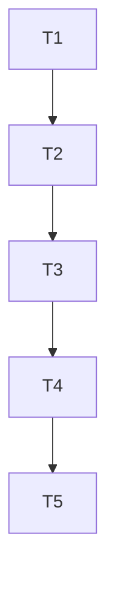

# Tasks: federated-central-vault-and-repo-identity

## Test Coverage Matrix

| Task | Requirement | Unit / Integration Test | Target File |
| :--- | :--- | :--- | :--- |
| T1 | FED-01, FED-02, FED-06 | `internal/config/config_test.go` | `internal/config/config.go` |
| T2 | FED-03, FED-04 | `internal/federation/bootstrap_test.go` | `internal/federation/bootstrap.go` |
| T3 | FED-04, FED-05 | `internal/federation/search_test.go` | `internal/federation/search.go` |
| T4 | FED-02, FED-03, FED-06 | `cmd/mem/setup_test.go` | `cmd/mem/setup.go` |
| T5 | FED-01..06 | Verificador independente e relatório TLC | `.specs/features/federated-central-vault-and-repo-identity/validation.md` |

---

## Gate Check Commands

```bash
# T1 Gate
go test -v ./internal/config/...

# T2 Gate
go test -v ./internal/federation/...

# T3 Gate
go test -v ./internal/federation/... ./internal/mcp/...

# T4 Gate
go test -v ./cmd/mem/... && .\bin\mem.exe status

# T5 Gate
python .agents/skills/tlc-spec-driven/scripts/validate_state.py federated-central-vault-and-repo-identity
```

---

## Execution Plan



---

## Task Breakdown

### Phase 1: Identity & Declarative Configuration

#### T1: Implementar repo_id imutável e configuração de central_vault
Where: internal/config/config.go
Depends on: none
Tests: internal/config/config_test.go
Gate: go test -v ./internal/config/...
Details:
- Adicionar campo `RepoID string` ao struct `Config`.
- Implementar gerador determinístico `GenerateRepoID()` no formato `repo_<12-hex-chars>`.
- Preservar o `RepoID` inalterado caso já exista no `config.yaml`.
- Adicionar suporte à leitura da configuração global em cascata `~/.memory/config.yaml`.
- Adicionar struct `CentralVaultConfig` com campos `Path string`, `ReadOnly bool` e `Include []string`.
- Implementar resolução com expansão automática de variáveis de ambiente (`${MY_MEMORY_CENTRAL_VAULT}` e `$VAR`).
- Criar testes unitários validando imutabilidade, expansão de envs, configuração global em cascata e defaults.

### Phase 2: Central Vault Auto-Bootstrap & Storage Isolation

#### T2: Implementar motor de Auto-Bootstrap do cofre central virgem
Where: internal/federation/bootstrap.go
Depends on: T1
Tests: internal/federation/bootstrap_test.go
Gate: go test -v ./internal/federation/...
Details:
- Criar pacote puro `internal/federation`.
- Implementar `BootstrapCentralVault(path string)` que detecta se o cofre central já foi inicializado.
- Caso virgem, criar árvore completa de diretórios: `standards`, `architecture`, `security`, `infrastructure`, `operations`, `data`, `ai-agents`, `domain`, `guides`, `templates` e `staging`.
- Gerar templates padrão em `templates/` (ADR, RFC, Runbook, Spec EARS).
- Gerar arquivo de boas-vindas `README.md` atuando como Mapa de Conteúdo (MOC) com wikilinks para cada pasta.
- Inicializar a subpasta isolada de dados `<central_path>/.memory/` com `config.yaml` (`repo_id: "repo_central"`) e banco SQLite em `storage/memory.db`.
- Criar testes unitários e de integração em diretórios temporários simulando bootstrap completo.

### Phase 3: Federated Search Engine

#### T3: Implementar busca híbrida federada (Local + Central via RRF)
Where: internal/federation/search.go
Depends on: T2
Tests: internal/federation/search_test.go
Gate: go test -v ./internal/federation/... ./internal/mcp/...
Details:
- Implementar `FederatedSearcher` capaz de consultar o cofre local e opcionalmente o cofre central.
- Suportar cofre central em SQLite isolado (`storage/memory.db`) ou PostgreSQL com namespace `repo_central`.
- Fusão de resultados locais e centrais utilizando Reciprocal Rank Fusion (RRF) com anotação explícita de proveniência (`[local]` vs `[central]`).
- Resiliência: se o caminho do cofre central não estiver montado ou acessível, registrar aviso suave e retornar resultados locais sem falhar.
- Integrar com a ferramenta MCP `memory_search` para retornar contexto federado para agentes de IA.
- Criar testes unitários validando fusão RRF, isolamento de escopo e tolerância a falhas.

### Phase 4: CLI Commands & Documentation

#### T4: Implementar assistente mem setup e subcomandos de central vault
Where: cmd/mem/setup.go
Depends on: T3
Tests: cmd/mem/setup_test.go
Gate: go test -v ./cmd/mem/... && .\bin\mem.exe status
Details:
- Implementar comando CLI `mem setup` para configuração guiada gravando em `~/.memory/config.yaml`.
- Adicionar comando CLI `mem central status` e `mem central bootstrap [<caminho>]`.
- Atualizar `mem status` para exibir status de vinculação do Central Vault e presença do `repo_id`.
- Atualizar `README.md`, `COMO_USAR.md` e `docs/CLI_GUIDE.md` com exemplos práticos de uso do Central Vault via Google Drive / OneDrive.
- Compilar o binário `bin/mem.exe` e validar `mem status`.

### Phase 5: Verification & Governance

#### T5: Verificação TLC e Snapshot de Estado
Where: .specs/features/federated-central-vault-and-repo-identity/validation.md
Depends on: T4
Tests: scripts/test_install.py
Gate: python .agents/skills/tlc-spec-driven/scripts/validate_state.py federated-central-vault-and-repo-identity
Details:
- Executar testes finais e gerar relatório de verificação independente `validation.md` com evidências `file:line`.
- Atualizar `.specs/STATE.md` registrando a decisão `AD-033` e o novo snapshot de handoff.
- Executar `mem index` e garantir 100% de integridade com `mem status`.
