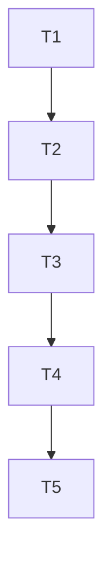

# Tasks: universal-binary-installer

## Test Coverage Matrix

| Task | Requirement | Unit / Integration Test | Target File |
| :--- | :--- | :--- | :--- |
| T1 | INST-01, INST-03, INST-04 | `scripts/test_install.ps1` | `scripts/install.ps1` |
| T2 | INST-02, INST-03, INST-04 | `scripts/test_install.py` | `scripts/install.sh` |
| T3 | INST-05 | ADR-032 e índice de ADRs | `docs/adr/032-instalador-universal-one-liner.md` |
| T4 | INST-05 | Documentação de Quick Install | `README.md` |
| T5 | INST-01..05 | Verificador independente e relatório TLC | `.specs/features/universal-binary-installer/validation.md` |

---

## Gate Check Commands

```bash
# T1 Gate
powershell -ExecutionPolicy Bypass -File scripts/test_install.ps1

# T2 Gate
python scripts/test_install.py

# T3 Gate
python .agents/skills/tlc-spec-driven/scripts/check_commit.py --message "docs(adr): record ADR-032 for universal binary installer"

# T4 Gate
.\bin\mem.exe status

# T5 Gate
python .agents/skills/tlc-spec-driven/scripts/validate_state.py universal-binary-installer
```

---

## Execution Plan



---

## Task Breakdown

### Phase 1: Windows & Unix One-Liner Installers

#### T1: Implementar e validar instalador PowerShell para Windows
Where: scripts/install.ps1
Depends on: none
Tests: scripts/test_install.ps1
Gate: powershell -ExecutionPolicy Bypass -File scripts/test_install.ps1
Details:
- Suportar parâmetros `-Version`, `-InstallDir`, `-Force`, `-NoPath`.
- Consultar a release mais recente via GitHub API `/releases/latest` com fallback para tag estável.
- Baixar `checksums.txt` da release e validar o hash SHA-256 do `.zip` baixado antes de extrair.
- Extrair `mem.exe` para o diretório de instalação do usuário (`$HOME\.mem\bin`) sem requerer elevação de privilégios.
- Injetar no `PATH` de usuário no registro do Windows e na sessão atual.
- Incluir fallback para `go install` caso os downloads falhem e o Go esteja instalado.
- Criar script de teste automatizado `scripts/test_install.ps1` simulando download e validação em diretório temporário isolado.

#### T2: Implementar instalador POSIX Shell para Linux e macOS
Where: scripts/install.sh
Depends on: T1
Tests: scripts/test_install.py
Gate: python scripts/test_install.py
Details:
- Detectar sistema operacional via `uname -s` (`Linux`, `Darwin`) e arquitetura via `uname -m` (`x86_64`, `arm64`, `aarch64`).
- Consultar a release mais recente via API do GitHub com fallback para tag estável.
- Baixar `checksums.txt` e verificar integridade SHA-256 via `sha256sum` ou `shasum -a 256`.
- Extrair `mem` em `$HOME/.local/bin` (ou `/usr/local/bin` se executado com privilégios de root) e conceder permissões executáveis (`chmod +x`).
- Verificar presença no `PATH` do usuário e emitir instruções claras para `.bashrc` / `.zshrc`.
- Criar teste de validação estática e funcional em `scripts/test_install.py`.

### Phase 2: Architecture Decisions & Documentation

#### T3: Registrar Decisão de Arquitetura ADR-032
Where: docs/adr/032-instalador-universal-one-liner.md
Depends on: T2
Tests: docs/adr/README.md
Gate: python .agents/skills/tlc-spec-driven/scripts/check_commit.py --message "docs(adr): record ADR-032 for universal binary installer"
Details:
- Redigir ADR-032 no padrão MADR documentando contexto, requisitos de segurança (no-root, SHA-256), alternativas consideradas (Homebrew Tap, Winget, MSI) e consequências positivas.
- Atualizar índice de decisões em `docs/adr/README.md` e `docs/README.md`.

#### T4: Atualizar Guias e Apresentação do Projeto
Where: README.md
Depends on: T3
Tests: COMO_USAR.md
Gate: .\bin\mem.exe status
Details:
- Adicionar seção de destaque "⚡ Instalação Rápida (1 Comando)" no topo do `README.md` cobrindo Windows e Linux/macOS.
- Atualizar `COMO_USAR.md` com o "Passo 0: Instalação Automática" e opção de compilação alternativa com `go install`.
- Atualizar `docs/CLI_GUIDE.md` com os parâmetros suportados pelos instaladores.

### Phase 3: Final Verification & Governance

#### T5: Verificação TLC e Snapshot de Estado
Where: .specs/features/universal-binary-installer/validation.md
Depends on: T4
Tests: scripts/test_install.py
Gate: python .agents/skills/tlc-spec-driven/scripts/validate_state.py universal-binary-installer
Details:
- Executar testes finais e gerar relatório de verificação independente `validation.md` com evidências `file:line`.
- Atualizar `.specs/STATE.md` registrando a decisão `AD-032` e o novo snapshot de handoff.
- Executar `mem index` e garantir conformidade com `mem status`.
