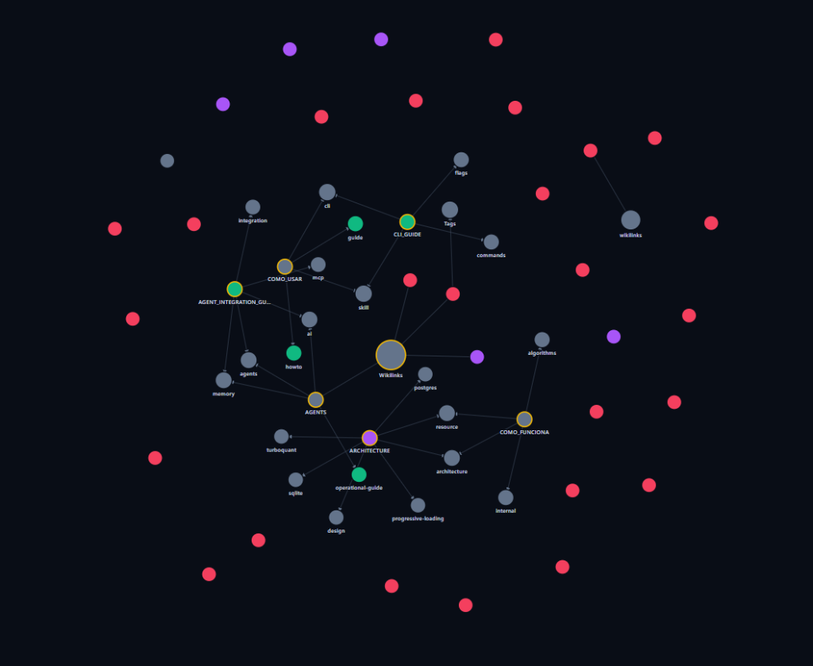

# 🧠 My-Memory

> **Transforme qualquer repositório ou vault Markdown em uma memória autoconsciente (*Repository Brain*) para você e seus Agentes de IA.**

[](https://go.dev/)
[](https://sqlite.org/)
[](https://github.com/asg017/sqlite-vec)
[](https://arxiv.org/abs/2504.19874)
[](https://modelcontextprotocol.io/)
[](LICENSE)

---

## 💡 Por que o My-Memory?

Agentes de IA (Claude Code, Cursor, Antigravity, GitHub Copilot, Windsurf) sofrem com limites de contexto e alucinações relacionais quando navegam em projetos grandes:
1. **Perda de Contexto:** Não é viável enviar centenas de arquivos para a janela de contexto sem estourar tokens e aumentar custos.
2. **Dependências Quebradas:** A IA altera um módulo sem saber quais componentes dependem dele no grafo.
3. **Decisões Esquecidas:** A IA refatora código ignorando decisões de arquitetura (ADRs) documentadas no passado.

O **My-Memory** resolve isso unificando **busca vetorial**, **grafo de conhecimento** e **busca léxica** em uma camada unificada de altíssima performance, acessível diretamente via terminal ou pelo **Model Context Protocol (MCP)**.

---

## ⚡ Arquitetura em 5 Pilares

```
                                [ Arquivos Markdown / Notas ]
                                              │
                         ┌────────────────────┴────────────────────┐
                         ▼                                         ▼
             [ Parser [[wikilinks]] & #tags ]            [ Chunking Semântico ]
                         │                                         │
                         ▼                                         ▼
               ( graph_nodes & edges )                  [ Ollama Embeddings ]
                         │                               (nomic-embed-text 768d)
                         │                                         │
                         │                         ┌───────────────┴───────────────┐
                         │                         ▼                               ▼
                         │                 [ sqlite-vec ]                 [ TurboQuant 4-bit ]
                         │                 (float32 k-NN)               (32 Reflexões Householder
                         │                         │                        + Bit-Packing)
                         │                         │                               │
                         ▼                         ▼                               ▼
       ┌───────────────────────────────────────────────────────────────────────────────────────┐
       │                              SQLite Local (memory.db)                                 │
       │  • documents         • chunks_vec (vec0)          • graph_nodes                       │
       │  • chunks            • chunks_turboquant (4-bit)  • graph_edges                       │
       │  • chunks_fts (BM25)                                                                  │
       └───────────────────────────────────────────────────────────────────────────────────────┘
                                                   ▲
                                                   │
                         ┌─────────────────────────┴─────────────────────────┐
                         ▼                                                   ▼
            [ CLI: mem search [-tq] ]                           [ Servidor MCP: mem mcp ]
             (Desenvolvedor no terminal)                           (Claude Code, Cursor, IAs)
```

1. **📦 SQLite Unificado & PostgreSQL Opcional:** Sem dependências pesadas (sem Neo4j, sem Pinecone, sem Elasticsearch). Armazena documentos, tabela virtual `sqlite-vec`, índice léxico `FTS5 (BM25)` e conexões de grafo em um arquivo local único ou em PostgreSQL corporativo com `pgvector`.
2. **🔬 TurboQuant (Google DeepMind, ICLR 2026):** Implementação pioneira em Go da quantização de 4-bits com 32 reflexões ortogonais de Householder ($R^T R = I$). Reduz o consumo vetorial em **~88%** (de 3.072 para 388 bytes por chunk) mantendo fidelidade $> 99\%$.
3. **🕸 Grafo Estilo Obsidian via SQL Recursivo:** Extrai conexões explícitas de notas (`[[links]]` e `#tags`), permitindo travessias relacionais, detecção de comunidades (LPA) e análise de raio de impacto em microssegundos.
4. **🔌 Model Context Protocol (MCP) Nativo:** Conecta-se diretamente aos assistentes de codificação de IA via `stdio` (JSON-RPC 2.0) ou rede HTTP/SSE, expondo ferramentas de busca e expansão de contexto.
5. **🏛️ Federação, Cofre Central e Wikilinks Cross-Vault:** Vincula um Cofre Central de padrões corporativos (Google Drive / OneDrive para Obsidian) a repositórios satélites com `repo_id` criptográfico imutável, catálogo global (`~/.memory/config.yaml`), zero-credentials no Git, busca híbrida federada via RRF e protocolo canônico universal `memory://<repo>/<path>` para resolução transparente de wikilinks cross-vault em editores e MCP.
6. **🌳 Code AST Indexing (tree-sitter, opt-in via `-tags treesitter`):** Parser sintático multi-linguagem (Go, Python, TS/JS, Rust, Java, C/C++, Ruby, PHP, Shell, C#) com persistência de símbolos/arestas em `code_files`/`code_symbols`/`code_edges`, boost RRF 2× em `qualified_name` e ferramentas CLI/MCP dedicadas (`mem code-index`/`code-search`/`code-graph`/`code-stats`, `memory_code_search`/`memory_code_neighbors`). Build padrão (sem tag) continua CGO-free e mantém o pipeline Markdown 100% funcional (CA-14, ADR-047).
7. **🖥 Viewer Desktop (Electron Forge 7 + React 19 + Vite 8 + shadcn v4 + Tailwind 4, Phase 1 MVP):** Desktop app cross-platform com Cytoscape bundled (zero-CDN), CSP strict via `session.webRequest.onHeadersReceived` em `electron/main.ts` + meta tag em `index.html`, locale switcher `pt-BR`/`en-US` persistido em `localStorage`. Layout 3-pane (Explorer / Editor / Chat) com `react-resizable-panels`, TopBar drag-region + window controls + pane toggles, shadcn `Sheet` constrained inside chat pane pra sessions list. i18n per-namespace (`common` / `topbar` / `graph` / `workspace` / `chat`) carregado de `src/localization/locales/{pt-BR,en-US}/*.json` — receita pra adicionar língua/namespace no docstring de `src/localization/i18n.ts`. ASR scaffold (ADR-045) com mic button + IPC pipeline, real Nemotron fica pros 9 tasks do spec `nemotron-asr-streaming`. Layout: `electron/` (main + preload + ipc + constants + utils/path + types.d.ts) + `src/` flat (renderer React). Aliases: `@/*` → `src/*`, `@electron/*` → `electron/*`. Decisões arquiteturais: [ADR-048](docs/adr/048-viewer-electron-react-vite-shadcn.md) (Electron + React + Vite + shadcn), [ADR-049](docs/adr/049-viewer-restructure-electron-forge-and-src-split.md) (restructure), [ADR-053](docs/adr/053-viewer-v3-3-pane-layout-shell.md) (3-pane shell) — veja [docs/VIEWER.md](docs/VIEWER.md) para setup e [`.specs/ROADMAP-v3-workspace-architecture.md`](.specs/ROADMAP-v3-workspace-architecture.md) para o roadmap M1-M7.

---

## 📊 Eficiência TurboQuant (Google DeepMind, ICLR 2026)

Para um vetor de 768 dimensões (`nomic-embed-text`):

| Formato | Precisão | Bytes / Chunk | Redução de Espaço | Fidelidade Angular |
| :--- | :--- | :--- | :--- | :--- |
| **Float32 Padrão** | 32-bit float | 3.072 bytes | Linha de Base | 100.0% |
| **Int8 Clássico** | 8-bit int | 768 bytes | ~75.0% | ~95.0% (sensível a outliers) |
| **TurboQuant 4-bit** | 4-bit packed | **388 bytes** | **~87.4%** | **> 99.0%** (ortogonalmente protegido) |

---

## ⚡ Instalação Rápida (1 Comando)

Instale a versão oficial compilada do **My-Memory** em segundos, com integridade criptográfica **SHA-256** verificada e configuração automática de PATH (sem requerer Go instalado):

#### Windows (PowerShell)
```powershell
irm https://raw.githubusercontent.com/FelipeMiiller/my-memory/main/scripts/install.ps1 | iex
```

#### Linux & macOS (POSIX Shell)
```bash
curl -fsSL https://raw.githubusercontent.com/FelipeMiiller/my-memory/main/scripts/install.sh | sh
```

> **Opção via Go Toolchain:** Se você possui Go $\ge$ 1.22 instalado:
> ```bash
> go install github.com/FelipeMiiller/my-memory/cmd/mem@latest
> ```

---

## 🚀 Início Rápido (Quickstart)

### 1. Inicializar o Vault no seu Projeto
Na pasta raiz do seu repositório de código ou vault de notas:
```bash
mem init
```
*(Gera a pasta `.memory/` com `repo_id`, escopo de pastas, `.gitignore` seguro e registra no catálogo global)*.

### 2. Configurar Cofre Central e Preferências Globais (Opcional)
```bash
mem setup
```
*(Assistente interativo que conecta seu Google Drive/OneDrive e grava em `~/.memory/config.yaml`)*.

### 3. Auto-Configurar Clientes de IA
```bash
mem install
```
*(Configura automaticamente Claude Desktop, Cursor, VS Code e Windsurf para se conectarem ao seu vault via MCP)*.

### 4. Indexar e Buscar
```bash
# Indexar notas com cache incremental SHA-256
mem index

# Busca híbrida federada (Local + Central via RRF)
mem search "como funciona o cache incremental?"
```

---

## 🌐 Visualizador Interativo de Grafo (`graph.html`)

O My-Memory gera um **visualizador interativo de grafo em HTML/SVG standalone** (Zero-CDN, sem internet ou dependências de bibliotecas externas). Ele transforma todas as conexões de notas Markdown, `[[wikilinks]]`, tags `#` e decisões arquiteturais em uma teia visual navegável em tempo real no seu navegador:

<p align="center">
  
</p>

### 🔍 O que a visualização revela:
- **Autoridade e Centralidade Estrutural (PageRank & God Nodes)**: O tamanho dos círculos é proporcional à autoridade estrutural calculada via **PageRank Ponderado** (ADR-014). Hubs centrais como `Wikilinks`, `ARCHITECTURE`, `AGENTS`, `COMO_USAR` e `CLI_GUIDE` emergem naturalmente como referências estruturais do repositório.
- **Clusters e Comunidades Semânticas (LPA)**: As cores dos nós refletem agrupamentos conceituais gerados pelo **Label Propagation Algorithm (LPA)** ponderado com cálculo de **Modularidade Newman-Girvan** (ADR-022), revelando subsistemas e domínios de conhecimento interligados.
- **Arestas Semânticas & Relações**: Linhas direcionadas demonstram fluxos de dependência e referências cruzadas (`links_to`, `tagged_as`, dependências técnicas).
- **Detecção Visual de Órfãos & Dead Links**: Nós periféricos (em tons avermelhados/magenta desconectados) representam notas isoladas ou referências quebradas, funcionando como uma auditoria visual complementar ao `mem doctor` (ADR-013).
- **Inspeção Cirúrgica em 3 Colunas (Triptych Node Inspector - ADR-024)**: Ao clicar em qualquer nó no gráfico interativo, abre-se um modal retrátil com visão cirúrgica completa:
  1. *Coluna 1 (Inbound)*: Notas e dependentes chamadores classificados por risco e PageRank.
  2. *Coluna 2 (Centro)*: Metadados canônicos, score de *Blast Radius* e preview de conteúdo seguro.
  3. *Coluna 3 (Outbound)*: Referências de saída com verificação ativa de integridade e atalho para abrir diretamente no Obsidian (`obsidian://open?file=...`).

### 🕹️ Como Gerar e Abrir:
```bash
# 1. Gerar e abrir automaticamente no navegador padrão
./bin/mem.exe graph view --open

# 2. Exportar para um arquivo HTML específico
./bin/mem.exe export --html graph.html

# 3. Via ferramenta MCP para Agentes de IA
# A tool memory_visualize_graph compila e salva o grafo instantaneamente.
```

---

## 📚 Navegação da Documentação

Para mergulhar nos detalhes operacionais, matemáticos e de integração, consulte os guias dedicados:

| Guia | Para quem é | Descrição |
| :--- | :--- | :--- |
| 📖 [**`COMO_USAR.md`**](COMO_USAR.md) | **Desenvolvedores** | Manual prático de comandos CLI, exemplos de busca, configuração de PostgreSQL/SQLite e monitoramento em tempo real. |
| 🔍 [**`COMO_FUNCIONA.md`**](COMO_FUNCIONA.md) | **Engenheiros & Arquitetos** | Explicação profunda da arquitetura, matemática do TurboQuant, algoritmo RRF, CTEs recursivas e ciclo de vida do cache. |
| 🤖 [**`AGENT_INTEGRATION_GUIDE.md`**](docs/AGENT_INTEGRATION_GUIDE.md) | **Agentes de IA & Integrações** | Como integrar o My-Memory com Cursor, Claude Code, Copilot e Antigravity via MCP e regras `AGENTS.md`. |
| 🏛 [**`docs/adr/`**](docs/adr/README.md) | **Decisões de Engenharia** | 41 Registros de Decisão de Arquitetura (ADRs) documentados no formato padrão MADR. |
| 🧠 [**`docs/concepts/architecture.md`**](docs/concepts/architecture.md) | **Engenheiros** | Stub conceitual: visão arquitetural consolidada (camadas, decisões centrais, ADRs relacionados). |
| 🧪 [**`docs/BENCHMARKS.md`**](docs/BENCHMARKS.md) | **Engenheiros de Performance** | Metodologia, resultados consolidados e como reproduzir benchmarks (TurboQuant, RRF, indexação, grafo). |
| 🔗 [**`docs/REFERENCES.md`**](docs/REFERENCES.md) | **Pesquisadores & Curiosos** | Projetos de referência (CodeGraph, Cursor, etc.) e matriz de refinamento arquitetural. |
| 🏗 [**`docs/REPOSITORY_BRAIN.md`**](docs/REPOSITORY_BRAIN.md) | **Integradores** | Como integrar My-Memory em qualquer projeto + convention de Concept Stubs (Spec 042). |

### 📜 Documentos do Repositório

| Doc | Descrição |
| :--- | :--- |
| 🤝 [[CONTRIBUTING|CONTRIBUTING.md]] | Como contribuir (Conventional Commits, testes, PR workflow). |
| 📜 [[CODE_OF_CONDUCT|CODE_OF_CONDUCT.md]] | Pacto de convivência da comunidade. |
| 🛡 [[SECURITY|SECURITY.md]] | Política de reporte e versões suportadas. |
| 📄 [[LICENSE|LICENSE]] | Licença MIT. |

---

## 🤖 Ferramentas MCP para Assistentes de IA

Quando executado como servidor MCP (`mem mcp`), o My-Memory disponibiliza 19 ferramentas para o ecossistema de IA:

- `memory_search`: Busca híbrida (RRF) unificando FTS, vetores e grafo com decaimento temporal opcional. Aceita `include_code: true` (default `false`, CA-12) para que `code_symbols` concorram no ranqueamento.
- `memory_get_neighbors`: Expansão recursiva de nós e dependências conectadas via SQL recursivo (CTEs) com marcação `is_federated: true`.
- `memory_find_path`: Descoberta do caminho mais curto entre duas notas via BFS bidirecional com pesos epistêmicos.
- `memory_get_impact`: Análise de raio de destruição (*Blast Radius*) e dependentes reversos com risk scoring.
- `memory_get_clusters`: Detecção de comunidades e módulos temáticos via LPA ponderado e modularidade Q.
- `memory_get_hubs`: Identificação de God Nodes e nós líderes por grau ou PageRank ponderado.
- `memory_get_insights`: Métricas globais da topologia da base de conhecimento (densidade, componentes, isolados).
- `memory_inspect_node`: Inspeção cirúrgica de nós (in-links, out-links com sinalização cross-vault, chunks quantizados e status).
- `memory_doctor`: Auditoria de integridade do grafo com detecção de dead links e notas órfãs.
- `memory_get_drift`: Auditoria de desvio semântico e divergência entre código e documentação.
- `memory_write_note`: Criação de notas atômicas estruturadas com sincronização e indexação instantâneas.
- `memory_append_section`: Adição atômica de seções a notas existentes com auto-linking e parsing.
- `memory_compile_note`: Síntese de fragmentos recuperados (*Compile-not-Retrieve*) para economia de contexto.
- `memory_pack_context`: Empacotamento de orçamento de contexto de tokens (Tier L0/L1/L2) com subgrafos Mermaid.
- `memory_visualize_graph`: Exportação de visualizador interativo em HTML/SVG standalone com física de forças.
- `memory_export_canvas`: Exportação bidirecional para o padrão Obsidian JSON Canvas 1.0 (.canvas).
- `memory_open_node`: Abertura cirúrgica de notas locais e canônicas federadas (`memory://`) no editor via deep links de IDE.
- `memory_code_search` *(ADR-047, CA-10)*: Busca estruturada de símbolos de código com filtros `language` e `kind`, ranqueada por boost RRF 2× em `qualified_name`. Requer build com `-tags treesitter`.
- `memory_code_neighbors` *(ADR-047, CA-11)*: Sub-grafo de chamadas/referências (in+out) de um símbolo até `depth` hops via CTE recursivo sobre `code_edges`.

---

## 📁 Estrutura do Repositório

```text
my-memory/
├── cmd/mem/            # Ponto de entrada CLI (init, index, search, inspect, impact, drift, mcp, etc.)
├── internal/
│   ├── autowire/       # Injeção e sugestão automática de wikilinks em Markdown
│   ├── canvas/         # Conversor e exportador para formato JSON Canvas 1.0 (.canvas)
│   ├── codeast/        # Pipeline tree-sitter (build tag treesitter), cache SHA-256/ast_hash, ranking e sub-grafo de código (ADR-047)
│   ├── compiler/       # Compilador semântico de contexto e síntese sob demanda
│   ├── config/         # Configuração declarativa, descoberta de vault e variáveis de ambiente
│   ├── db/             # Schemas SQLite, virtual tables sqlite-vec e queries recursivas CTE
│   ├── deeplink/       # Integração e deep linking com editores (VS Code, Cursor, Obsidian)
│   ├── drift/          # Análise de divergência semântica e staleness entre git e documentação
│   ├── embedder/       # Cliente Ollama e resolução dinâmica de modelos de embedding
│   ├── federation/     # Federação multirrepositório, RRF e resolução de URIs canônicas memory://
│   ├── graph/          # Algoritmos de grafo (LPA, modularidade Q, PageRank, Blast Radius, Inspector)
│   ├── graphview/      # Visualizador interativo HTML/SVG standalone com física de forças
│   ├── mcp/            # Servidor Model Context Protocol com 17 tools (stdio + HTTP/SSE)
│   ├── parser/         # Extração de wikilinks, tags, metadados e chunking
│   ├── repo/           # Scanner de arquivos do repositório respeitando escopo e gitignore
│   ├── staleness/      # Rastreamento de desatualização temporal de notas e links quebrados
│   ├── store/          # Camada de armazenamento unificada e suporte a PostgreSQL com pgvector
│   ├── turboquant/     # Rotações ortogonais de Householder e quantização de 4-bit
│   └── watcher/        # File watcher em segundo plano com debouncing inteligente
├── docs/               # Documentação técnica detalhada e 31 ADRs
├── COMO_USAR.md        # Manual prático passo a passo para o usuário
├── COMO_FUNCIONA.md    # Explicação detalhada da arquitetura e funcionamento interno
├── AGENTS.md           # Regras operacionais para Agentes de IA
└── README.md           # Apresentação geral do projeto
```

---

## 🧪 Validação e Testes

O My-Memory conta com cobertura de testes unitários e de integração em todos os 19 pacotes Go:

```bash
# Executar todos os testes do repositório
go test -count=1 ./...

# Executar testes com relatório de cobertura
go test -v -cover ./internal/turboquant/... ./internal/graph/... ./internal/parser/...
```

---

## 📄 Licença

Distribuído sob a licença [MIT](LICENSE).
