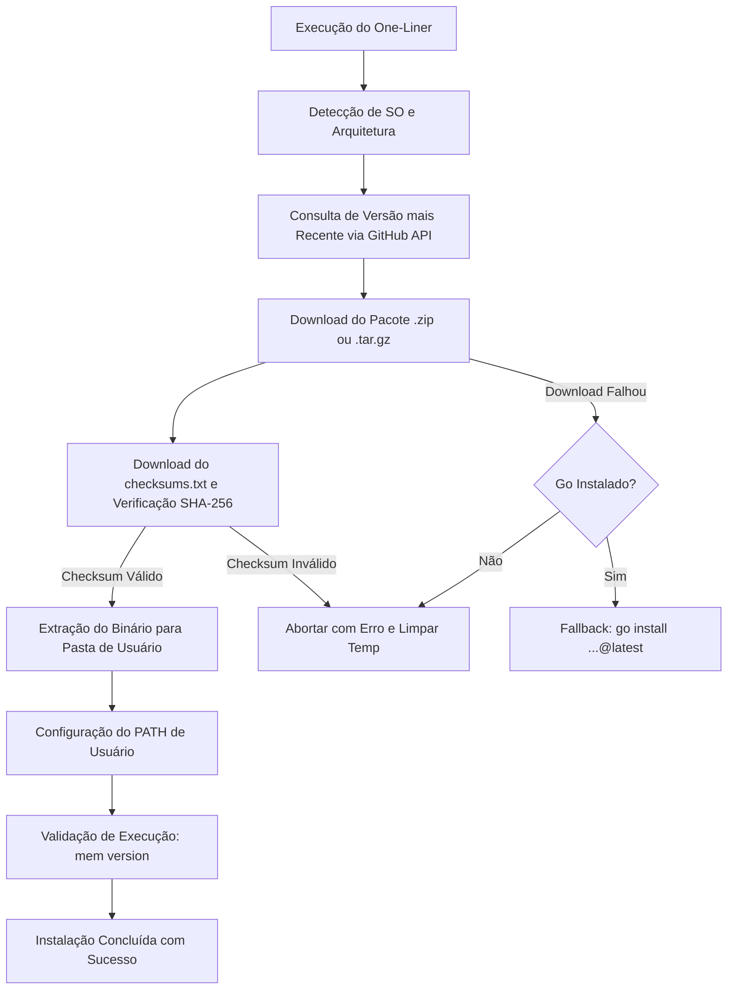

# ADR-032: Instalador Universal One-Liner para Windows, Linux e macOS (`install.ps1` e `install.sh`)

- **Date**: 2026-09-14
- **Status**: Accepted
- **Deciders**: Felipe Miiller, Antigravity
- **Tags**: installer, one-liner, devx, release-automation, powershell, posix-shell, sha256, security

## Context and Problem Statement

Para utilizar o `my-memory`, desenvolvedores e agentes de IA precisavam compilar o binário manualmente via toolchain Go (`go build ./cmd/mem` ou `go install`) ou acessar a página de Releases do GitHub para baixar e descompactar os pacotes manualmente.

Esse fluxo impunha atrito considerável na experiência do desenvolvedor (DevX), especialmente em máquinas sem o ambiente Go instalado, em ambientes corporativos com restrições de instalação ou em pipelines de inicialização rápida de containers e agentes autônomos.

Fazia-se necessária uma solução de instalação em um único comando (*one-liner*), transparente, multiplataforma, segura e sem requisitos de privilégios elevados (administrador/root).

## Decision Drivers

- **Zero-Dependency Bootstrap**: Permitir a instalação imediata do executável sem exigir a presença prévia de Go ou compiladores CGO no sistema host.
- **Instalação Multiplataforma**: Suporte de primeira classe para **Windows** (PowerShell 5.1/7+) e **Linux / macOS** (POSIX `sh`, `bash`, `zsh`).
- **Segurança e Integridade Criptográfica**: Validação estrita de hash **SHA-256** contra o manifesto `checksums.txt` emitido na release oficial antes de qualquer extração ou execução.
- **Escopo do Usuário (No-Root / Non-Admin)**: Instalação em diretórios locais de usuário (`$HOME/.mem/bin` no Windows e `$HOME/.local/bin` no Linux/macOS), sem necessidade de elevação de privilégios (`sudo` ou UAC).
- **Configuração Automática de PATH**: Inclusão idempotente do diretório no `PATH` de usuário (Registro no Windows, instruções/profile no Unix) com flag de desativação (`--no-path`).
- **Resiliência e Fallback Automático**: Caso os endpoints de download estejam temporariamente inacessíveis e o host possua Go instalado, o script executa automaticamente o fallback via `go install`.

## Considered Options

1. **Instaladores Nativos de 1 Linha (PowerShell + POSIX sh)** *(Opção Escolhida)*
2. **Gerenciadores de Pacotes de Terceiros (Homebrew, Winget, Scoop, APT)**
3. **Instaladores Gráficos com Assistente (MSI, PKG, DMG)**

## Decision Outcome

Adotou-se a **Opção 1**: scripts universais oficiais versionados no repositório em `scripts/install.ps1` e `scripts/install.sh`.

### 1. Comandos Oficiais One-Liner

#### Windows (PowerShell)
```powershell
irm https://raw.githubusercontent.com/FelipeMiiller/my-memory/main/scripts/install.ps1 | iex
```

#### Linux & macOS (POSIX Shell)
```bash
curl -fsSL https://raw.githubusercontent.com/FelipeMiiller/my-memory/main/scripts/install.sh | sh
```

### 2. Arquitetura dos Instaladores



### 3. Parâmetros e Customizações Suportadas

Ambos os instaladores suportam parametrização completa:
- **Versão Específica**: `-Version v1.2.0` (PowerShell) / `--version v1.2.0` (POSIX sh)
- **Diretório Customizado**: `-InstallDir C:\meu\caminho` / `--dir /meu/caminho`
- **Não Alterar PATH**: `-NoPath` / `--no-path`
- **Sobrescrita Forçada**: `-Force` / `--force`

## Positive Consequences

- **Adoção Imediata**: Usuários iniciam o `my-memory` em menos de 10 segundos em qualquer sistema operacional.
- **Proteção contra Adulteração**: Nenhum binário é executado sem verificação prévia do hash SHA-256 gerado pelo pipeline de build seguro do GitHub Actions.
- **Sem Fricção de Privilégios**: Executa perfeitamente em ambientes restritos, shells compartilhados e terminais sem privilégios administrativos.
- **Compatibilidade Retroativa**: Scripts testados em Windows PowerShell 5.1 (sem dependência de emojis ou BOM UTF-8) e POSIX `sh` minimalista.

## Negative Consequences

- **Dependência de Acesso à Internet / GitHub**: A instalação inicial requer conectividade de rede para download dos assets do repositório `FelipeMiiller/my-memory`.
