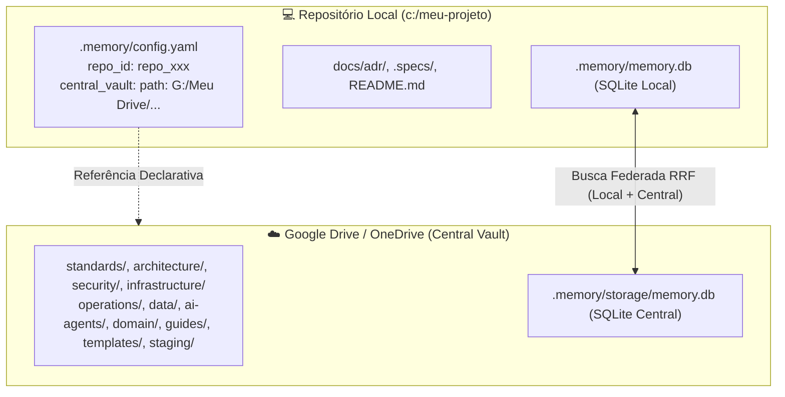

# ADR-033: Arquitetura Federada de Vault Central e Identidade Imutável de Repositório (`repo_id`)

- **Date**: 2026-09-15
- **Status**: Accepted
- **Deciders**: Felipe Miiller, Antigravity
- **Tags**: federation, central-vault, repo-id, google-drive, multi-vault, postgresql, sqlite, bootstrap, devx

## Context and Problem Statement

À medida que múltiplos projetos e microsserviços utilizam o `my-memory`, surge a necessidade de gerenciar o conhecimento em dois níveis distintos:
1. **Conhecimento Transversal e Perene (*Global Brain*)**: Padrões de arquitetura corporativa, normas de API REST/gRPC, diretrizes de segurança (OAuth2, JWT), políticas de DevOps, glossário de domínio e lições aprendidas.
2. **Conhecimento Específico de Projeto (*Local Brain*)**: Código-fonte, ADRs locais (`docs/adr/`), especificações de features (`.specs/`) e notas táticas de cada repositório.

A tentativa ingênua de sincronizar esse conhecimento via *Git Submodules* ou cópia física de arquivos para dentro dos repositórios de código gera atrito operacional severo: polui o `git status`, provoca merge conflicts em *detached HEAD*, confunde clientes móveis do Obsidian e sobrecarrega os repositórios locais com arquivos desnecessários.

Adicionalmente, se múltiplos repositórios compartilham uma instância de PostgreSQL ou se sincronizam com pastas em nuvem (Google Drive / OneDrive), a identificação por simples nomes de pasta é frágil, sujeita a colisões e quebras quando repositórios são renomeados ou movidos.

## Decision Drivers

- **Zero Poluição de Git**: Nenhum arquivo do cofre central deve ser clonado ou commitado dentro dos repositórios de código locais.
- **Identidade Criptográfica Imutável (`repo_id`)**: Cada repositório deve receber um identificador único, persistente e imutável gerado na inicialização, utilizado para isolamento em bancos de dados.
- **Armazenamento Central em Nuvem (Google Drive / OneDrive / Obsidian)**: O Vault Central deve residir em uma pasta sincronizada pelo usuário, permitindo navegação fluida no Obsidian Desktop e Mobile.
- **Isolamento e Limpeza no Armazenamento**: Arquivos de banco de dados SQLite central não devem poluir a raiz de notas Markdown, residindo isoladamente em `<central_path>/.memory/storage/memory.db`.
- **Topologia de Banco Híbrida (PostgreSQL ou SQLite Everywhere)**:
  - Se PostgreSQL estiver configurado (`MY_MEMORY_PG_URL`), ele centraliza todos os repositórios com particionamento/schemas isolados por `repo_<id>` e `repo_central`.
  - Se SQLite for o único motor, cada repositório opera com seu banco local e consulta o banco central do Google Drive em modo somente-leitura com fusão via RRF.
- **Zero-Touch Bootstrap**: Se o usuário referenciar uma pasta central vazia ou virgem no `config.yaml`, o `my-memory` deve inicializar automaticamente a árvore de diretórios estruturada (`standards/`, `architecture/`, `security/`, `infrastructure/`, `operations/`, `data/`, `ai-agents/`, `domain/`, `guides/`, `templates/`, `staging/`), com arquivos modelo e o banco central.

## Considered Options

1. **Git Submodules / Git Subtree** (Descartado: alto atrito de manutenção, conflitos de branch e incompatibilidade no Obsidian Mobile).
2. **Duplicação Manual de Arquivos** (Descartado: cria divergência de versões e impossibilita atualizações contínuas).
3. **Vault Central Vinculado com Identidade Imutável (`repo_id`) e Auto-Bootstrap** (*Opção Escolhida*).

## Decision Outcome

Adotou-se a **Opção 3**:



### 1. Identidade Imutável no `.memory/config.yaml`
Na primeira execução de `mem init`, o sistema gera deterministicamente `repo_id` (ex: `repo_a1b2c3d4e5f6`), persistido no `config.yaml`. Esse identificador é permanente. O cofre central assume o ID canônico `repo_central`.

### 2. Configuração do Vault Central Vinculado
```yaml
# .memory/config.yaml
version: 1
repo_id: "repo_9f8b7a12e34c"
repository: "empresa/api-pagamentos"
vault_name: "API de Pagamentos"

central_vault:
  path: "G:/Meu Drive/KnowledgeBase"   # ou ${MY_MEMORY_CENTRAL_VAULT}
  read_only: true
```

### 3. Auto-Bootstrap de Estrutura de Conhecimento
Ao detectar que a pasta apontada em `central_vault.path` não possui `.memory/`, o `my-memory` cria:
- `standards/`, `architecture/`, `security/`
- `infrastructure/`, `operations/`, `data/`
- `ai-agents/`, `domain/`, `guides/`, `templates/`, `staging/`
- `README.md` raiz atuando como Mapa de Conteúdo (MOC) com `[[wikilinks]]`.
- `.memory/config.yaml` e `.memory/storage/memory.db`.

### 4. Busca Federada Multi-Banco (RRF)
Em tempo de consulta (`mem search` ou ferramenta MCP), o sistema consulta a base do projeto e a base central (SQLite em `.memory/storage/memory.db` ou PostgreSQL com `repo_central`), consolidando os resultados com **Reciprocal Rank Fusion**.

## Positive Consequences

- **Repositórios Limpos**: Zero lixo de submódulos ou sincronizadores dentro do Git do projeto.
- **Alta Resiliência e Portabilidade**: Suporte a caminhos parametrizados por variáveis de ambiente (`MY_MEMORY_CENTRAL_VAULT`).
- **Navegação Perfeita no Obsidian**: O usuário edita o cofre central normalmente no Obsidian Desktop ou Mobile via Google Drive/OneDrive.
- **Proteção Contra Escritas Indevidas**: Agentes de IA consom as normas centrais em modo somente-leitura, salvando código e ADRs locais apenas no projeto.

## Negative Consequences

- **Dependência de Montagem Local para SQLite**: No modo SQLite, a pasta do Google Drive/OneDrive precisa estar montada na máquina para que a busca federada acesse o cofre central (com fallback elegante para o cofre local caso a pasta esteja ausente).
